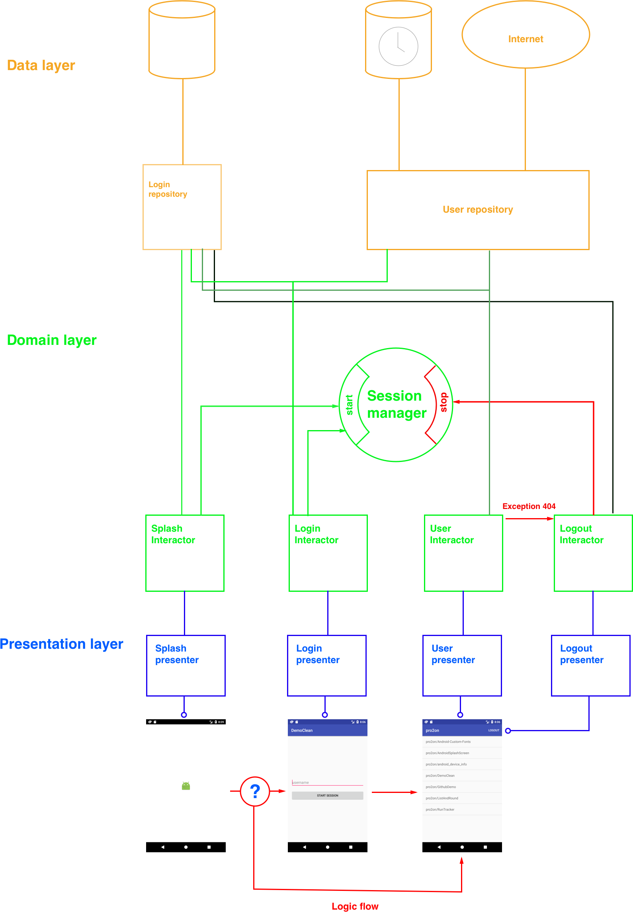

Hi there!

So what you can find here:

1. At first, main app structure is standing on respect  to clean architecture. Classes situate at different layers, it gives us ability to test all use cases. Really very helpfull. Do you want to see app's reaction to HTTP error - just replace certain repository.

2. Dependency injection is saving  from writing the large amount of boilerplate code.

3. As for MVP, I use Moxy library for this purposes. Saves a lof of time. With Moxy it's no need to take care about view's lifecycle - just write a code.

App structure:

 

